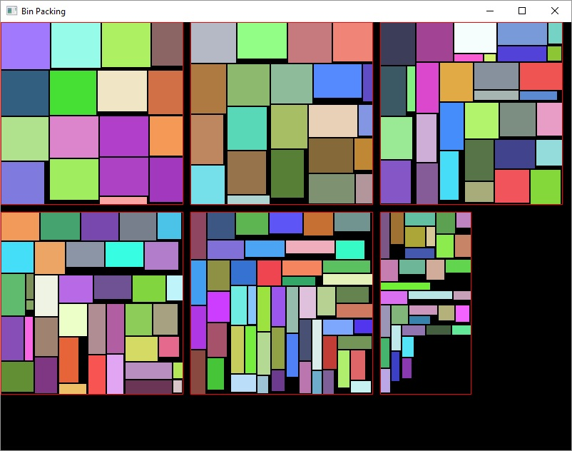

A rectangular bin packing algorithm for texture atlases.

```C++
#include <binpacking.h>
using namespace binpacking;

// sizes of input rectangles
std::vector<Size> sizes;
sizes.push_back(Size(20, 60));
sizes.push_back(Size(30, 40));
// ...

// Max side length of an output bin.
// Must be a power of two.
// Output bin may be non-square.
int maxSize = 128;

// Pixels of padding between rectangles in the bin (see image below).
int padding = 2;

// Set this to true to allow input rectangles to be rotated by
// 90 degrees when doing so would result in tighter packing.
bool allowRotation = true;

// Returns N-1 bins of 'maxSize' by 'maxSize', and one bin of equal or smaller size.
// Each bin will contain a set of RectMapping objects that map input sizes to bin positions.
std::vector<Bin> bins = Pack(sizes, maxSize, padding, allowRotation);

for(auto& bin : bins) {
    for(auto& mapping : bin.mappings) {
        // ...
    }
}
```


